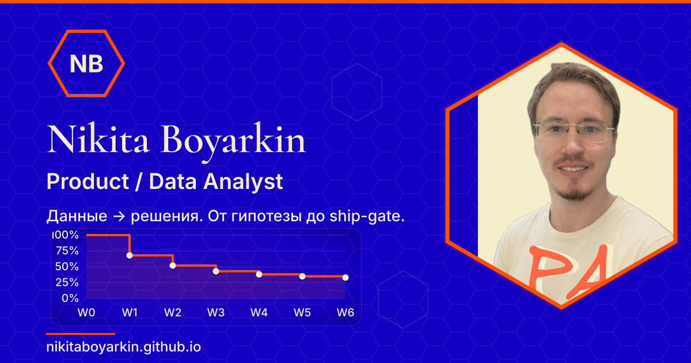

# NikitaBoyarkin.github.io

Personal portfolio site of **Nikita Boyarkin** — Product / Data Analyst.
Static Astro build, bilingual (RU / EN), 17 case studies, client JS only where it earns its place.

[](https://github.com/NikitaBoyarkin/NikitaBoyarkin.github.io/actions/workflows/deploy.yml)

**Live:** https://nikitaboyarkin.github.io/ · **EN mirror:** https://nikitaboyarkin.github.io/en/



## Contents

- [What's on the site](#whats-on-the-site)
- [Projects](#projects)
- [Stack](#stack)
- [Requirements](#requirements)
- [Quick start](#quick-start)
- [Verification](#verification)
- [Project structure](#project-structure)
- [Content](#content)
- [Analytics](#analytics)
- [OG image generation](#og-image-generation)
- [CV](#cv)
- [GitHub ↔ portfolio sync](#github--portfolio-sync)
- [Monitoring](#monitoring)
- [CI/CD](#cicd)
- [Local hooks](#local-hooks)
- [Documentation](#documentation)
- [License](#license)

## What's on the site

Russian is the default locale; every route below has an `/en/…` mirror unless noted.

| Route | What it holds |
|---|---|
| `/` | Home — hero, headline cases, career snapshot, bento grid, featured writing |
| `/projects/` | Catalogue — all 17 cases as a board, grouped by `track` |
| `/projects/<slug>/` | Case study page (RU source + EN mirror) |
| `/projects/volta/<part>/` | The 23 linked sub-parts of the Volta case |
| `/about/` | About + jump nav to anchors `#who`, `#work`, `#now`, `#start` |
| `/value/` | "Чем могу быть полезен" — the conversion page |
| `/notes/` | Notes hub with category filters (absorbs `/guides/`) |
| `/writing/` | Paginated article archive |
| `/topics/`, `/topics/<tag>/` | Topic taxonomy and level grouping |
| `/graph/` | Knowledge graph of the notes — communities, force layout, zoom |
| `/contact/` | Contact |
| `/404` | RU only — no EN mirror, no `hreflang` |

Generated endpoints: `/rss.xml`, `/sitemap-index.xml`, `/robots.txt`, `/llms.txt`, `/.well-known/llms.txt`, `/search-index.json`, `/graph.json`, `/graph-en.json`. Search is client-side over `search-index.json` — there is no `/search/` page.

## Projects

**17 case studies**, each with a page at `/projects/<slug>/`, a board column set by `track`, and a public repo and/or live demo where one exists. Three are the **headline cases** featured on the home page — `volta`, `sql`, `cohort` — chosen because each is backed by a reachable public artifact.

Links: **page** = the case study on the live site · **repo** = source on GitHub · **demo** = runnable artifact.

### `track: experiments`

| Project | What it shows | Links |
|---|---|---|
| **Volta Neobank** | Found the onboarding bottleneck and closed it with an A/B test: **+5.72 pp** KYC conversion, **€656K/yr**. 23 linked sub-projects across funnel → A/B → retention → segmentation | [page](https://nikitaboyarkin.github.io/projects/volta/) · [repo](https://github.com/NikitaBoyarkin/volta-banking) · [demo](https://nikitaboyarkin.github.io/demos/volta/index.html) |
| **A/B Testing Toolkit** | 15 methodology modules, each calibrated by simulation — A/A holds Type I error at α, power curves plot achievable effect sizes | [page](https://nikitaboyarkin.github.io/projects/ab/) · [repo](https://github.com/NikitaBoyarkin/ab_test) |
| **Browser Mini-Games** | 10 playable mini-games in self-contained SVG — 7 teaching analytics (A/B to p<0.05, funnel drop-off, cohort catch, retention day), 3 arcade | [page](https://nikitaboyarkin.github.io/projects/games/) · [repo](https://github.com/NikitaBoyarkin/browser-mini-games) · [demo](https://nikitaboyarkin.github.io/games/) |
| **Causal / Uplift** | CUPED cut the standard error by **26%**: same power on 5.6k users per arm instead of 10k. Uplift models recover heterogeneous treatment effects | [page](https://nikitaboyarkin.github.io/projects/causal/) · [repo](https://github.com/NikitaBoyarkin/causal-uplift) |

### `track: analytics`

| Project | What it shows | Links |
|---|---|---|
| **SQL Analytics Case Study** | 26 SQL cases — 25 on a synthetic dataset (~183k events) plus 1 real-data on UCI Online Retail II: funnel, retention, LTV, attribution | [page](https://nikitaboyarkin.github.io/projects/sql/) · [repo](https://github.com/NikitaBoyarkin/sql-analytics-case-study) · [demo](https://nikitaboyarkin.github.io/sql-analytics-case-study/) |
| **RFM Segmentation** | Split a bank's client base into 4 RFM segments and showed a small high-value share drives most of the revenue; marketing moved off mass campaigns | [page](https://nikitaboyarkin.github.io/projects/rfm/) · [repo](https://github.com/NikitaBoyarkin/rfm-analysis-of-bank-clients) · [demo](https://nikitaboyarkin.github.io/demos/rfm/index.html) |
| **Cohort Analysis** | Triangular retention and LTV cohort matrix on synthetic data: ARPU and LTV per cohort corrected for observation age, with export | [page](https://nikitaboyarkin.github.io/projects/cohort/) · [repo](https://github.com/NikitaBoyarkin/tableau_cohort_analysis) · [demo](https://nikitaboyarkin.github.io/demos/cohort/index.html) |
| **Churn Prediction** | Leakage-free model: recall@top-10% = **0.53**, lift **3.07×** at ROC-AUC 0.904 on a chronological split — no future-activity leakage | [page](https://nikitaboyarkin.github.io/projects/churn/) · [repo](https://github.com/NikitaBoyarkin/churn-prediction) |
| **Python Analytics Playground** | Modular Python toolkit — load, clean, EDA, visualise — assembled into one pipeline with pytest coverage ≥ 80% | [page](https://nikitaboyarkin.github.io/projects/python/) · [repo](https://github.com/NikitaBoyarkin/python) |
| **Sales Calls Analytics** | Streamlit dashboard over 16,891 synthetic AI-call records: 4-step funnel (greeting → offer → meeting → qualification) and loss analysis | [page](https://nikitaboyarkin.github.io/projects/sales-calls/) · [repo](https://github.com/NikitaBoyarkin/sales-calls-dashboard) |

### `track: product`

| Project | What it shows | Links |
|---|---|---|
| **Supabase Product Analytics** | Full-stack analytics on Supabase: A/B gave **+5.1 pp** (p = 0.0034, chi-square); a Streamlit dashboard reads live data through Row-Level Security | [page](https://nikitaboyarkin.github.io/projects/supabase/) · [repo](https://github.com/NikitaBoyarkin/supabase-product-analytics) |
| **TaskFlow × PostHog** | A SaaS product instrumented end-to-end with PostHog: typed event catalogue, generated traffic and 7 analyses — funnel, retention, paths | [page](https://nikitaboyarkin.github.io/projects/posthog/) · [repo](https://github.com/NikitaBoyarkin/posthog-saas-analytics) |
| **Streamlit Dashboard** | Product dashboard on a synthetic SaaS dataset (8,000 users): AARRR funnel, cohort retention, revenue — MRR, ARPU, churn | [page](https://nikitaboyarkin.github.io/projects/streamlit/) · [repo](https://github.com/NikitaBoyarkin/streamlit-app) |

### `track: engineering`

| Project | What it shows | Links |
|---|---|---|
| **Reporting Automation Bot** | Telegram bot replaced manual weekly reporting with cron: 1–2 hours of manual work became a scheduled report with KPI tables | [page](https://nikitaboyarkin.github.io/projects/bot/) · [demo](https://nikitaboyarkin.github.io/demos/telegram/index.html) |
| **Scrolly English Speaking** | Scrollytelling guide to spoken English for work conversations (A2–B1): MDX narrative with D3 visualisations | [page](https://nikitaboyarkin.github.io/projects/scrolly/) · [repo](https://github.com/NikitaBoyarkin/scrolly-english-speaking) |
| **Digital Garden** | Personal Zettelkasten published as a Quartz v4 site: linked notes, backlinks and a graph instead of a chronological feed | [page](https://nikitaboyarkin.github.io/projects/garden/) · [repo](https://github.com/NikitaBoyarkin/digital_garden) |
| **This Portfolio Site** | The site you are reading: Astro 7, TypeScript, Markdown collections, static build, dark/light theme, RSS, sitemap, JSON-LD, Pages deploy | [page](https://nikitaboyarkin.github.io/projects/site/) · [repo](https://github.com/NikitaBoyarkin/NikitaBoyarkin.github.io) |

Board order is set by `PROJECT_ORDER` in `src/lib/projects.ts`; featured cases by `HEADLINE_PROJECTS` in the same file. Every metric above is authored in the project's Markdown file and cross-checked against `src/lib/metrics.ts`.

## Stack

| Layer | Choice |
|---|---|
| Framework | [Astro](https://astro.build/) 7 (`output: "static"`, no `base` — user Pages site served from the domain root) |
| Language | TypeScript 5.9 (strict), Astro components |
| Content | Markdown collections with Zod schemas (`src/content.config.ts`, Astro Content Layer) |
| Styling | Hand-written CSS custom properties (`src/styles/global.css`), 3 themes: dark (default), light, cyberpunk |
| Toolchain | [Bun](https://bun.sh/) — install, scripts, tests (`bun:test`), lockfile |
| Analytics | PostHog (`posthog-js`), inert when the build-time key is unset; optional Plausible |
| Hosting | GitHub Pages via GitHub Actions |
| Charting | Native SVG chart components + `src/lib/chart-svg.ts` (no chart library) |

No client framework ships: interactive bits (search, graph, theme, filters, analytics) are small vanilla modules, and `posthog-js` loads lazily after the first interaction.

## Requirements

- **Bun** — the only package manager used here (`bun.lock` is the lockfile)
- **Python 3** for `make check` (`scripts/check_site.py`)
- **`rsvg-convert`** (librsvg) — only for regenerating OG images
- Optional: `GITHUB_TOKEN` / `GH_TOKEN` for the GitHub sync scripts (higher rate limit, sees private repos)

## Quick start

```bash
bun install
bun run dev          # http://localhost:4321
bun run build        # static output → dist/
bun run preview      # serve the production build
```

## Verification

Run this quartet after every content or component change. All green = safe to commit.

```bash
bun run build        # Astro build
bun run check        # astro check + tsc --noEmit on tests
make check           # python3 scripts/check_site.py — validates the built dist/
bun test             # bun:test unit suite (tests/lib/)
bun run coverage     # same suite with coverage
```

`make check` is not a type check — it inspects the **built output** and fails on:

- missing required pages
- internal links that do not resolve to a file in `dist/`
- missing images referenced from HTML
- the profile photo exceeding 500 KB
- required assets absent from `index.html`
- **metrics drift** — headline numbers in `src/lib/metrics.ts` vs. the site (`check_metrics_drift`)

Lighthouse CI runs separately — see [CI/CD](#cicd).

## Project structure

```text
├── astro.config.mjs        # site, i18n, redirects, sitemap
├── src/
│   ├── content.config.ts   # Zod schemas for all 6 collections
│   ├── content/            # Markdown: projects(-en), posts(-en), volta-parts(-en)
│   ├── layouts/            # Base.astro (nav, theme, meta, PostHog), Post.astro
│   ├── components/         # 27 components + 7 chart primitives — cards, filters, graph, hero
│   ├── lib/                # pure logic: metrics, topics, graph, fuzzy, charts, brand, path
│   ├── pages/              # 24 routes + endpoints (rss, sitemap, robots, llms.txt, search-index.json)
│   ├── data/               # chart data + generated github-activity.json
│   └── styles/             # global.css (tokens + themes), blog.css
├── scripts/                # OG/CV generators, GitHub sync, check_site.py, content-drift-audit, mobile audits
├── tests/lib/              # 20 bun:test suites for src/lib/*
├── docs/                   # PRDs, ADRs, SPEC, analytics review ritual
├── monitoring/             # local RED monitoring stack (Prometheus + Grafana)
└── public/                 # images, hero SVGs, OG images, fonts, CV PDF, demos, games
```

`src/lib/` holds all non-trivial logic and is the only part covered by unit tests. Components stay presentational.

### Key `src/lib` modules

| Module | Responsibility |
|---|---|
| `metrics.ts` | **Single source of truth** for headline numbers (hero, career snapshot, value page, CV cross-check) |
| `projects.ts` | `PROJECT_ORDER`, project loading, sorting |
| `topics.ts` | `TOPICS` taxonomy + level grouping — drives `/topics/` |
| `posts.ts` | Post loading, `PER_PAGE` pagination |
| `graph.ts` / `graph-layout.ts` / `graph-data.ts` / `graph-tooltip.ts` / `graph-zoom.ts` / `graph-url.ts` | Build-time knowledge graph: greedy-modularity communities, force layout, interaction |
| `charts.ts` / `chart-svg.ts` | Chart config and the SVG primitives the chart components render |
| `fuzzy.ts` | Dependency-free Levenshtein ≤ 2 for search (Cyrillic-safe) |
| `analytics.ts` / `beacon.ts` / `scroll-depth.ts` | Client analytics: typed `track()`, RED beacon, read-depth |
| `brand.ts` | Palette tokens + WCAG contrast assertion (shared with the OG renderer) |
| `path.ts` | `withBase()` — use it for every internal link and asset path |
| `llms-txt.ts` | Build-time `llms.txt` generator, shared by `/llms.txt` and `/.well-known/llms.txt` so the two cannot drift |
| `qa-corpus.ts` | Curated bilingual Q&A corpus behind the "Ask me" widget (`AskMe.astro`) |

## Content

Six collections, schemas in `src/content.config.ts`:

| Collection | Files | Language |
|---|---|---|
| `projects` | 17 | RU |
| `projects-en` | 17 | EN |
| `volta-parts` | 23 | RU |
| `volta-parts-en` | 23 | EN |
| `posts` | 24 | RU |
| `posts-en` | 2 | EN |

### Add a project

1. Create `src/content/projects/<id>.md` **and** `src/content/projects-en/<id>.md` — always both.
2. Add a hero SVG to `public/images/` (the `hero` field is required).
3. Set `track` (`experiments` | `analytics` | `product` | `engineering`) for the kanban board.
4. Add the slug to `PROJECT_ORDER` in `src/lib/projects.ts`.
5. `bun run build && make check`.
6. `bun run sync:gh:apply` to set `updated:` from the repo's last push.

### Add a blog post

Create `src/content/posts/<slug>.md`. `category` must be one of `decision-log`, `framework`, `guide`, `note` — a local hook (`portfolio-category-guard.js`) blocks anything else. Add an EN mirror in `posts-en/` when it should be bilingual.

### Authoring rules

- **Project page skeleton** (H2 order): `Контекст → Гипотеза? → Данные и метод → Что нашли? → Эффект → Документация`. EN: `Context → Hypothesis? → Data & Method → Findings? → Impact → Documentation`. `volta` keeps its own narrative.
- **Descriptions:** 1–2 sentences, result + number first, 120–200 chars; the first 72 chars must stand alone (`MaterialStrip` truncates there). Author RU and EN independently — meaning parity, not literal translation.
- **Numbers are frozen.** A readability rewrite never changes a metric. `bun run audit:content` diffs every numeric token in `src/content/**` against `docs/content-baseline.json` and exits 1 on any change. Accept an intentional change with `bun run audit:content:snapshot`.
- **`related:` is locale-neutral** — write `/projects/<slug>/` and `/posts/<slug>/` in both languages; the EN resolver prefixes `en/` itself. Never write `/en/projects/...`.
- **Volta hub map is generated.** The grouped map in `projects/volta.md` between `<!-- volta-map:start -->`/`<!-- volta-map:end -->` comes from `bun run volta:map`. Re-run after adding or renaming a part.
- Fold one-off sections (`Architecture`, `Run`, `Testing`, …) under `Данные и метод` / `Data & Method`.

### Bilingual routing

- RU is the default locale; EN mirrors live in `src/pages/en/` and render the `-en` collections.
- Every `Base` page passes `lang` and `counterpartHref`; `LangSwitch.astro` toggles and emits `<link rel="alternate" hreflang>`.
- When adding a page, ship both languages and wire `counterpartHref` on both sides.
- RU-only on purpose — no EN mirror, no hreflang: `notes`, `404`.

### Redirects

Old routes collapse into the `/about` anchor cluster (`astro.config.mjs`): `/whois/`, `/work-with-me/`, `/now/`, `/start/` → `/about/#…` (with `/en/` twins for the first three); `/guides/` → `/notes/guides/`; `/cv/` → the CV PDF.

## Analytics

`src/components/Analytics.astro` renders the PostHog snippet. It is **inert unless the build-time env vars are set** — all of them are `PUBLIC_*`, so they bake into the static build:

| Variable | Purpose |
|---|---|
| `PUBLIC_POSTHOG_KEY` | Project token — no snippet rendered when unset |
| `PUBLIC_POSTHOG_HOST` | Defaults to `https://us.i.posthog.com` |
| `PUBLIC_PLAUSIBLE_DOMAIN` | Optional — Plausible script, for a privacy-friendly counter |
| `PUBLIC_PLAUSIBLE_SRC` | Optional — custom or self-hosted Plausible script URL |
| `PUBLIC_BEACON_ENDPOINT` | Optional — pushes scroll-depth / RED beacon events to the monitoring stack (`BeaconMetrics.astro`) |

Copy `.env.example` to `.env` for local development; for CI the same names go into GitHub Actions secrets.

`src/lib/analytics.ts` is the **only** client module that talks to PostHog besides `Analytics.astro` (which owns init). Components call `track()`; they never touch the global. `posthog-js` is lazy-loaded after the first user interaction, so consumer chunks stay off the critical path, and `track()` buffers (bounded, flushed on attach) rather than dropping early events.

Typed events (`AnalyticsEventMap`): `project_viewed`, `post_read`, `lang_switched`, `theme_change`, `ask_me_used`, `random_post_click`, `section_viewed`, `outbound_click`, `search_used`, `search_no_results`, `read_depth`, `filter_applied`, `projects_track_filter`. Super properties: `locale`, `theme`, `prefers_reduced_motion`, `initial_referrer_class`, `landing_path` — the first-touch class is computed once per visitor and persisted.

**Convention:** any element carrying `data-analytics="<name>"` fires `<name>` on click through a delegated listener in `Analytics.astro` (`hero_projects`, `hero_contact`, `cv_download_pdf`, `featured_project`, `bento_*`, …). New CTAs should reuse that attribute instead of calling `track()` for the same click — mix the two and a click is counted twice.

## OG image generation

```bash
bun run og         # per-post OG cards (24 PNG + webp)
bun run og:home    # homepage identity banner
bun run og:graph   # knowledge-graph preview
bun run og:cv      # CV OG / LinkedIn / cover variants (og:cv:li, og:cv:cover)
bun run og:watch   # regenerate on change
```

Rendering goes through `rsvg-convert` with vendored fonts in `scripts/og-fonts/`. `scripts/lib/og-render.mjs` sets **both** `FONTCONFIG_FILE` and `PANGOCAIRO_BACKEND=fc` — macOS defaults to the CoreText backend, which ignores fontconfig and silently renders the wrong font. Every generated banner passes a WCAG AA contrast assertion before it is written. Palette lives in `src/lib/brand.ts`, shared with `global.css`. `scripts/audit-palette-coverage.mjs` reports where palette tokens are used (it has no npm script — run it directly with `bun`).

## CV

The CV is **not authored here**. It lives in a separate [rendercv](https://github.com/rendercv/rendercv) project at `../cv/` (`Boyarkin_Nikita_Product_Analyst_CV.yaml`). The portfolio ships one downloadable PDF, `public/CV-Nikita-Boyarkin.pdf`, behind a single "CV" button on every page.

```bash
# in ../cv/
rendercv render Boyarkin_Nikita_Product_Analyst_CV.yaml
# here
bun run cv:pdf     # copies into public/ — override the source dir with CV_SOURCE_DIR
```

Headline numbers must agree with `src/lib/metrics.ts`. Commit the PDF; do not reintroduce a hand-authored `/cv/` page.

## GitHub ↔ portfolio sync

`scripts/sync-github-projects.mjs` keeps `updated:` and `private:` frontmatter in sync with the GitHub API for every repo referenced by `github:` (RU + EN twins). It never touches `date:`, which is the authored publication date.

```bash
bun run sync:gh              # check mode — reports drift, exit 1 on hard drift (runs in CI)
bun run sync:gh:apply        # write updated:/private: back into frontmatter
bun run sync:gh --dry-run    # preview
bun run sync:gh:candidates   # public, non-fork repos not yet featured
```

`scripts/sync-github-activity.mjs` writes `src/data/github-activity.json` (contributions, streaks, 5 chart cards) for the `/about` charts. Auth via `GITHUB_TOKEN` / `GH_TOKEN` / `STREAK_PAT`. Both run on schedules — see [CI/CD](#cicd).

## Monitoring

`monitoring/` holds a self-contained RED stack (Rate / Errors / Duration): a Bun exporter with Prometheus exposition + embedded SQLite, Prometheus, Grafana and a Cloudflare tunnel. Runs locally via Docker. See [`monitoring/README.md`](monitoring/README.md) — it needs a PostHog **personal** API key, not the public project token.

## CI/CD

Three workflows in `.github/workflows/`:

| Workflow | Trigger | Does |
|---|---|---|
| `deploy.yml` | push / PR to `master` \| `main` | install → **GitHub drift gate** (`sync:gh`, exits 1) → `bun run check` → build → `make check` → Lighthouse CI → deploy `dist/` to Pages |
| `sync-github.yml` | weekly | runs `sync:gh:apply` and opens a PR with the changes |
| `github-activity.yml` | daily | refreshes `github-activity.json`; commits only when the payload changed |

Pull requests run every gate **except** deploy. Lighthouse runs in a separate job with no analytics env vars, so the scores stay clean.

Lighthouse assertions (`.lighthouserc.json`, 7 URLs): accessibility, best-practices and SEO are **errors** at ≥ 0.95; performance is a **warning** at ≥ 0.85.

Do not push to `master` before confirming Pages is set to `Settings → Pages → Build and deployment → GitHub Actions`.

## Local hooks

`.claude/hooks/` — `contrast-gate.js` (colour-contrast gate on generated output) and `portfolio-category-guard.js` (blocks post frontmatter with an out-of-taxonomy `category`).

`bun run verify:writing-filter` is a Playwright regression check for the `/writing/` filter. It runs against a **served build** (`bun run serve-dist` first, or point `BASE_URL` anywhere) and guards the CSS-cascade bug fixed in `src/styles/blog.css`, where an author `display` beat the UA `[hidden] { display: none }` rule and the list stayed visible after a filter click.

## Documentation

| Path | Contents |
|---|---|
| `CLAUDE.md` | Full repository guide — schemas, conventions, command reference |
| `CONTEXT.md` | Domain glossary for the conversion surface (RU) |
| `docs/prd-v8.md` | Current PRD (RU) — replaces `prd-v7.md` |
| `docs/cta-inventory.md` | Every CTA, its event and destination |
| `docs/analytics-events.md` | Event catalogue with payloads |
| `docs/analytics-review.md` | Weekly 15-minute analytics ritual + funnel benchmark |
| `docs/contact-log.md` | Manual hiring funnel log |
| `docs/backlog.md` | Open work |
| `docs/adr/` | Architecture decision records |
| `DESIGN.md` | Visual system notes |

> Older PRDs (`prd-v2` … `prd-v7`) are kept for history. Prefer `docs/prd-v8.md` and `CLAUDE.md` when they disagree.

## License

See [`LICENSE.txt`](LICENSE.txt). Site content and copy are personal — please don't reuse the text or profile assets.
